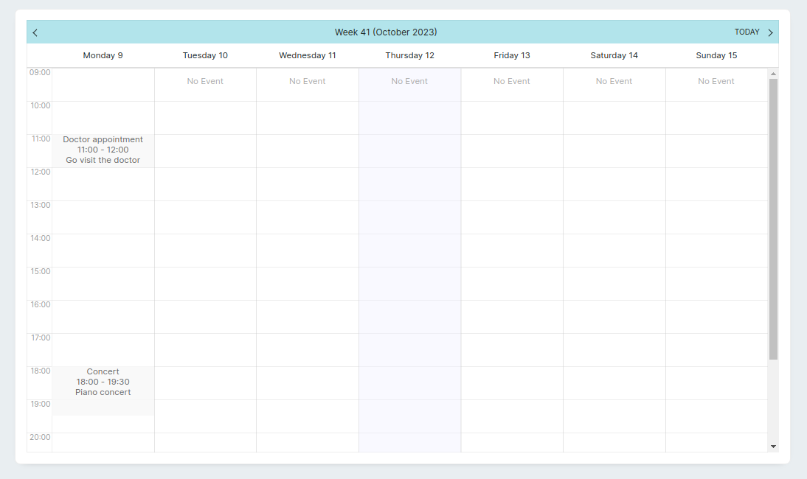
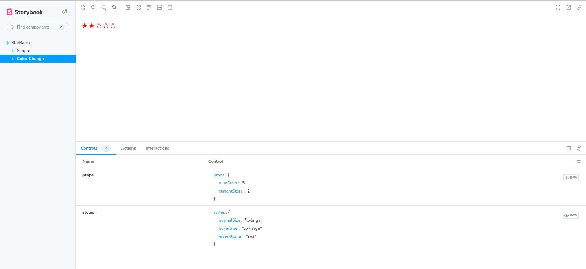

# streamsync-widgets

[](https://jreyesr.github.io/streamsync-widgets)

This repo contains a bunch of [Streamsync](https://www.streamsync.cloud/) [custom components](https://www.streamsync.cloud/custom-components.html), that you can use in your own Streamsync applications.

Streamsync comes with [a set of Components](https://www.streamsync.cloud/component-list.html) that you can use to build UIs. For instance, there's the standard Form inputs (text field, text area, number, slider, date picker, single/multi-dropdown, file picker), buttons, a Timer, a webcam capture element, a [Repeater](https://www.streamsync.cloud/repeater.html), a table and layout elements (horizontal/vertical stacks, columns). This repo holds some more specialized elements, that don't necessarily belong on a general-purpose UI builder.

This repo aims to bring Streamsync's selection of UI elements closer to low-code/no-code UI builder tools such as [Retool](https://retool.com/components/editable-text) or [Appsmith](https://docs.appsmith.com/reference/widgets), which have far larger UI element libraries. If there's a certain component in a tool like these, it's probably a good candidate for this repo.

## Usage

If you'd like to use one or more of the widgets included here in your own Streamsync apps:

> At the moment, there's no process in place that automatically compiles the widgets into their own JS files, so you can just drop them in your Streamsync project. Contributions are welcome! Until then, you'll have to compile the widgets that you'd like to use yourself.

Note: these instructions are more or less the same as those [in Streamsync's docs](https://www.streamsync.cloud/custom-components.html#developing-templates), except that you won't be developing your own components, but reusing them from this repo.

1. Clone Streamsync: `git clone https://github.com/streamsync-cloud/streamsync`
1. Run `npm install`
1. Select a widget that you'd like to use
1. Create a Vue file in the `ui/src/custom_components` directory of your cloned Streamsync repo, paste the contents of the desired widget's file there
1. Edit the `ui/src/custom_components/index.ts` file. Add the new component there. You have an example [in the `index.ts` file in this repo](https://github.com/jreyesr/streamsync-widgets)
1. Run `npm run custom.build`
1. This will generate a new directory, `ui/custom_components_dist` in your Streamsync repo. This directory will contain a JS file and a CSS file. Copy both
1. In your actual Streamsync project (i.e. not the Streamsync repo, but your own app that uses Streamsync as a framework, which you'll probably have created [with these instructions](https://www.streamsync.cloud/getting-started.html#create-an-app)), create a directory called `extensions`, then copy the `custom_components_dist` directory there
1. In your Streamsync application's directory, run `streamsync edit .` to start the Streamsync UI Builder
1. Streamsync should detect the `extensions` folder and load its contents
1. On the Toolkit to the left (from where you drag components to the UI), you should see the new components. They have a small icon to the right of their names, indicating that they are Custom Components as opposed to built-in ones
1. Ensure that you also include the `extensions` directory when running your app without the editor (via `streamsync run`, or [in Docker](https://www.streamsync.cloud/deploy-with-docker.html))

## List of widgets

[](https://jreyesr.github.io/streamsync-widgets)

Browse [the Storybook that contains the components](https://jreyesr.github.io/streamsync-widgets) to play with some of the components.

### Loading Overlay

File: `LoadingOverlay.vue`

A container that hides whatever is inside it, blocks interactions (e.g. clicks) and displays a loading spinner. The loading state is controlled via a state binding (e.g. `@{is_loading}`).

A more detailed description of the component [is here](https://jreyesr.github.io/posts/streamsync-custom-components/#container-custom-components).


### Signature pad

File: `SignaturePad.vue`

Provides the user a canvas in which to draw a signature, using [the `signature_pad` JS library](https://szimek.github.io/signature_pad/). The signature is available to the backend by using the `signature-change` event, whose payload is a Base64-encoded PNG image containing the contents of the canvas.

A more detailed description of the component [is here](https://jreyesr.github.io/posts/streamsync-custom-components/#components-that-reuse-third-party-vue-packages).


### Sortable list

File: `SortableList.vue`

Creates a List, like the Repeater component, where the elements can be rearranged by dragging-and-dropping them. Like the Repeater component, it takes a JS Object/Python dict, and renders one copy of its children for each element of the object. Current versions of both JS and Python do respect the order of object/dicts, so this component should _not_ display its elements in random order.

Emits a `list-reorder` event whenever a reorder operation concludes (by dropping the picked element). The payload is another object/dict, which has the entries in their new order.


> **NOTE:** This widget doesn't currently work with an unmodified copy of Streamsync, since 
> the component requires some context variables (namely `itemId` and `item`) which Streamsync
> only makes available to the built-in Repeater component, [explicitly](). See 
> [this section](https://jreyesr.github.io/posts/streamsync-custom-components/#components-with-repeatedvariable-children),
> especially near the end, for more information.

### Star rating

File: `StarRating.vue`

Renders a 5-star "rating"-style control (the number of stars is configurable).

A more detailed description of the component [is here](https://jreyesr.github.io/posts/streamsync-custom-components/#star-rating-component).


### Agenda

File: `Agenda.vue`

Renders a calendar in weekly view, which can display events (each with the time interval that it occurs on). It's similar to Thunderbird's calendar view.



## Contributing

Contributions of any kind are most welcome! For example:

* More widgets
* Bug reports on existing widgets
* More options or events on already-existing widgets
* Better docs, or a better way of generating them
* Infrastructure-related tasks, such as a way of automatically compiling and releasing every custom component as its own JS+CSS files, so users can pick-and-choose which components they want to embed in their own apps

If you need any help, feel free to [open an issue](https://github.com/jreyesr/streamsync-widgets/issues) and ask away!

### Storybook

The custom components are integrated with [Storybook](https://storybook.js.org/) to showcase them in different states. For example, here's the Star Rating component:



To run the Storybook server:

```bash
npm run storybook
```

To add new stories, refer to the `stories/StarRating.stories.ts` file. The main points to be aware of are:

* As is tradition in Storybook, you write "stories" for a component. Each Story is meant to showcase a specific configuration of the component. For example, for a button you may want to write Stories that show the button in its normal state, disabled, large, with a loading spinner, and more
* Since Streamsync doesn't receive data via standard Vue props, you must use [the `args` parameter](https://storybook.js.org/docs/vue/writing-stories/args) differently. Instead of providing an object with Vue props, provide an object with the keys `props` and `styles`:
    * The `props` field should be an object with all the configuration values that go on the Properties section to the right of the Streamsync Builder UI
    * The `styles` fields should be an object with all the configurations that have `applyStyleVariable: true` in the component's `streamsync` field, i.e. the configurations that will be served by Steampipe as CSS vars
* The render function for Storybook is fairly generic. Use [the one in Storybook's starter docs](https://storybook.js.org/docs/vue/get-started/whats-a-story) or use and modify one from an already-existing `.stories.ts` file